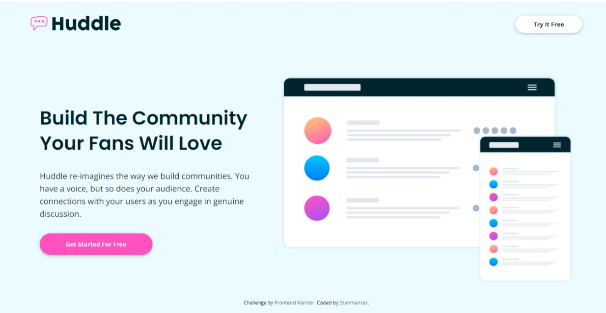

# Frontend Mentor - Huddle landing page with alternating feature blocks solution

This is a solution to the [Huddle landing page with alternating feature blocks challenge on Frontend Mentor](https://www.frontendmentor.io/challenges/huddle-landing-page-with-alternating-feature-blocks-5ca5f5981e82137ec91a5100).

## Table of contents

-   [Overview](#overview)
    -   [The challenge](#the-challenge)
    -   [Screenshot](#screenshot)
    -   [Links](#links)
-   [Author](#author)

## Overview

### The challenge

The challenge is to build out this landing page and get it looking as close to the [design](./design/desktop-design.jpg) as possible.

Users should be able to:

-   View the optimal layout for the site depending on their device's screen size
-   See hover states for all interactive elements on the page

### Screenshot

### Links

-   Solution URL: [Frontend Mentor Solution Page](https://frontendmentor.io)
-   Live Site URL: [Hosted on Github pages](https://stanmancer.github.io/huddle-landing-page/)

## Author

-   Website - [Stanmancer](https://limey.io/stanmancer)
-   Frontend Mentor - [@stanmancer](https://www.frontendmentor.io/profile/stanmancer)
